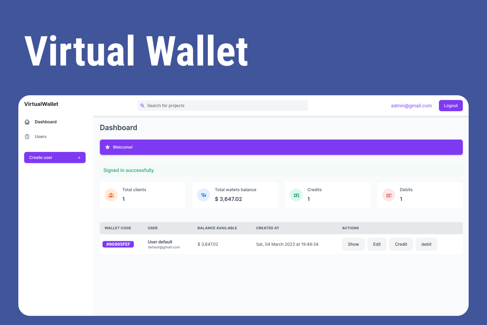
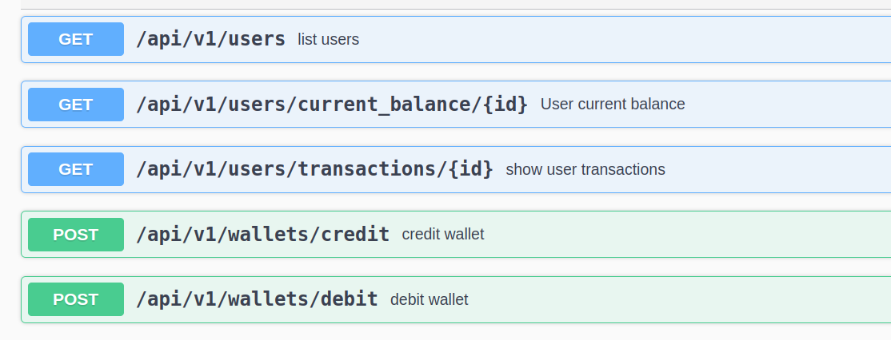

<br>
<div align="center">
    
</div>
<br>

## 💻 Projeto

 **Virtual wallet manager - Gerenciar usuários e suas carteiras virtuais**
 - [Descrição do projeto](https://github.com/forlav/challenge-2)

## 🚀 Tecnologias

- Ruby 3.2.0
- Rails 7.0.4
- PostgreSQL
- Hotwire - (Turbo e Stimulus)
- Tailwind CSS
- Importmap
- Gem: Devise
- Gem: Rspec
- Gem: Rswag - Swagger
- Gem: Active model serializers

## 💥 Funcionalidades

**WEB**
- [x] Login - Admin
- [x] CRUD de Usuários
- [x] Creditar ou debitar dinheiro na carteira do usuário
- [x] Histórico de transações realizadas ordenadas por data e hora

**API**
- [x] GET: Listar usuários.
- [x] GET: Obter o saldo atual de um usuário
- [x] GET: Listar ás transacões de um usuário
- [x] POST: Creditar valor na conta do usuário
- [x] POST: Debitar valor do usuário

## ⚡ Instalando o Projeto

```bash
# clonar o projeto
git clone git@github.com:GeorgePires/virtual-wallet.git

# entre no diretório clonado
cd virtual-wallet

# instalar dependências do Ruby on Rails
bundle install

# instalar dependências do Node
npm install

# criar os bancos de dados e adicionar admin e user
rails dev:setup

```
```bash
# Admin de exemplo
    - Admin: admin@gmail.com | senha: 123246
```
```bash
# executar o projeto
./bin/dev 

Entre no endereço: http://localhost:3000
```
## 🔰 API Virtual Wallets

```bash
# Swagger
- http://localhost:3000/api-docs
```
<div align="center">
    
</div>
<br>